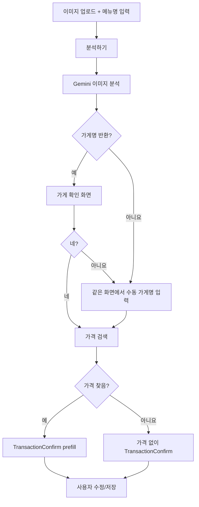

# QuickAdd 이미지-매칭 아키텍처

## 1. 목적

QuickAdd 이미지-매칭은 사용자가 매장 관련 이미지를 업로드하고 메뉴명을 입력하면, Gemini가 이미지를 분석해 가게명을 반환하고, 사용자가 그 결과를 확인한 뒤 메뉴 가격을 자동으로 채워 주는 보조 입력 기능이다.

이 기능의 목적은 아래 두 가지다.

- 사용자가 지출을 입력할 때 `가게명`, `메뉴명`, `가격`을 최대한 자동으로 채운다.
- 최종 저장 전에 사용자가 반드시 한 번 더 확인할 수 있게 한다.

최종 저장은 항상 기존 지출 확인 화면에서 사용자가 직접 검토한 뒤 진행한다.

## 2. 사용자 흐름

1. 사용자가 QuickAdd에서 이미지-매칭을 선택한다.
2. 이미지 업로드 화면에서 사진을 업로드한다.
3. 같은 화면에서 메뉴명을 입력한다.
4. `분석하기`를 누른다.
5. 백엔드는 Gemini로 이미지를 분석해 가게명 1개를 반환한다.
6. 프론트는 두 번째 화면에서 업로드한 이미지와 함께 `이 가게가 맞나요?` 확인 화면을 보여준다.
7. 사용자가 `네`를 누르면 메뉴 가격 검색을 진행한다.
8. 사용자가 `아니요`를 누르면 같은 화면 안에서 수동 가게명 입력 UI를 펼친다.
9. 사용자가 수동으로 가게명을 입력하면 그 값으로 가격 검색을 진행한다.
10. 프론트는 기존 지출 확인 화면에 `가게명`, `메뉴명`, `가격`, `카테고리`, `날짜`를 채워 보여준다.
11. 사용자가 내용을 수정한 뒤 저장한다.

## 3. 전체 처리 흐름



## 4. 프론트엔드 설계

### 4.1 화면 상태

권장 상태 머신:

- `imageMatchInput`
- `analyzingStore`
- `storeConfirm`
- `resolvingPrice`
- `confirm`
- `error`

현재 [QuickAddPopup.js](C:/Duduk/Hyper-personalized-AI-consumer-coaching/frontend/src/components/home/QuickAddPopup.js)는 `input`과 `confirm`만 갖고 있으므로, 이미지-매칭 전용 2단계 화면이 들어가도록 상태를 확장해야 한다.

### 4.2 상태별 UI/UX

#### `imageMatchInput`

필수 UI:

- 이미지 업로드 영역
- 메뉴명 입력창
- `분석하기` 버튼
- 상단 닫기 `X`

동작 규칙:

- 이미지와 메뉴명이 모두 있어야 `분석하기` 버튼이 활성화된다.
- 이미지 업로드 후에는 즉시 미리보기를 보여준다.
- 메뉴명은 자유 입력으로 받는다.
- 앱과 웹 모두에서 업로드 가능해야 한다.

권장 문구:

- `간판, 컵 로고, 메뉴판처럼 가게를 알 수 있는 사진일수록 정확해요`

#### `analyzingStore`

필수 UI:

- 업로드한 이미지 미리보기
- 사용자가 입력한 메뉴명
- `가게 분석 중...` 로딩 문구

권장 문구:

- `이미지 안의 간판, 로고, 매장 정보를 확인하고 있어요`

#### `storeConfirm`

필수 UI:

- 업로드한 이미지 미리보기
- 사용자가 입력한 메뉴명
- Gemini가 반환한 가게명
- 버튼 2개
  - `네, 맞아요`
  - `아니요`

권장 보조 문구:

- `이미지 분석 결과로 찾은 가게예요`

이 단계의 목적은 가격 검색 전에 가게명을 확정하는 것이다.

`아니요`를 누른 경우 처리:

- 새 화면으로 이동하지 않는다.
- 같은 화면 안에서 가게명 입력창을 펼친다.
- 사용자는 가게명만 직접 입력한다.
- `이 이름으로 가격 찾기` 버튼을 누르면 다음 단계로 진행한다.

#### `resolvingPrice`

필수 UI:

- 확정된 가게명
- 메뉴명
- `가격 찾는 중...` 로딩 문구

#### `confirm`

기존 [TransactionConfirm.js](C:/Duduk/Hyper-personalized-AI-consumer-coaching/frontend/src/components/home/TransactionConfirm.js)를 재사용한다.

prefill 대상:

- `store`
- `item`
- `amount`
- `category`
- `date`

위치 정보는 이미지-매칭 단계에서 자동으로 채우지 않는다. 필요하면 사용자가 확인 화면에서 직접 수정한다.

### 4.3 권장 컴포넌트 구조

- [QuickAddPopup.js](C:/Duduk/Hyper-personalized-AI-consumer-coaching/frontend/src/components/home/QuickAddPopup.js)
  - 전체 상태 머신과 단계 전환 담당
- [ImageMatching.js](C:/Duduk/Hyper-personalized-AI-consumer-coaching/frontend/src/components/home/ImageMatching.js)
  - 이미지-매칭 진입 버튼
- `frontend/src/components/home/ImageMatchEntry.js`
  - 이미지 업로드 + 메뉴명 입력
- `frontend/src/components/home/ImageMatchStoreConfirm.js`
  - 가게 확인 화면 + 수동 가게명 입력 UI
- `frontend/src/lib/api/imageMatch.js`
  - 이미지-매칭 API 호출 모듈

프론트 상태 예시:

```json
{
  "imagePreviewUrl": "blob:...",
  "imageData": "base64...",
  "imageFormat": "jpg",
  "menuName": "아이스 아메리카노",
  "sessionId": "im_123",
  "analyzedStoreName": "",
  "confirmedStoreName": "",
  "showManualStoreInput": false,
  "resolvedPrefill": null
}
```

## 5. 백엔드 설계

### 5.1 API 구성

권장 엔드포인트:

- `POST /api/transactions/image-match/analyze-store/`
- `POST /api/transactions/image-match/resolve-price/`
- `POST /api/transactions/create/`

현재 [urls.py](C:/Duduk/Hyper-personalized-AI-consumer-coaching/backend/apps/transactions/urls.py)에는 이미지-매칭용 엔드포인트가 없으므로 추가가 필요하다.

### 5.2 서비스 구성

- `ImageMatchSessionService`
  - 세션 생성, 조회, 만료 처리
- `ImageStoreAnalyzerService`
  - Gemini로 이미지에서 가게명 추출
- `MenuPriceResolverService`
  - 확정된 가게명과 메뉴명으로 가격 검색
- `TransactionPrefillBuilder`
  - 확인 화면용 응답 생성

권장 파일 위치:

- [views.py](C:/Duduk/Hyper-personalized-AI-consumer-coaching/backend/apps/transactions/views.py)
- [urls.py](C:/Duduk/Hyper-personalized-AI-consumer-coaching/backend/apps/transactions/urls.py)
- `backend/apps/transactions/services/image_match.py`
- [client.py](C:/Duduk/Hyper-personalized-AI-consumer-coaching/backend/external/ai/client.py)

### 5.3 세션 구조

이미지 분석과 가격 검색이 분리되므로 세션이 필요하다.

권장 저장 형태:

```json
{
  "session_id": "im_123",
  "user_id": 1,
  "menu_name": "아이스 아메리카노",
  "image_hash": "sha256...",
  "analyzed_store_name": "스타벅스 강남역점",
  "status": "store_identified",
  "created_at": "2026-03-31T10:00:00+09:00",
  "expires_at": "2026-03-31T10:30:00+09:00"
}
```

이미지 원본은 장기 저장하지 않는다. 분석이 끝난 뒤에는 세션과 분석 결과만 남긴다.

## 6. 가게 분석 로직

### 6.1 입력

`analyze-store` API 입력:

```json
{
  "imageData": "base64...",
  "format": "jpg",
  "menu_name": "아이스 아메리카노"
}
```

### 6.2 Gemini 역할

Gemini는 이미지에서 가게를 식별할 수 있는 단서를 읽고, 사용자에게 보여 줄 가게명 1개를 반환한다.

반환해야 하는 값은 `store_name` 하나다.

예시:

```json
{
  "store_name": "스타벅스 강남역점"
}
```

### 6.3 가게명 반환 규칙

- 이미지에 보이는 정보만 사용한다.
- 보이지 않는 지점명은 추정해서 만들지 않는다.
- 가게를 특정할 수 없으면 `store_name`은 `null`로 반환한다.
- `store_name`이 `null`이면 프론트는 같은 확인 단계에서 수동 가게명 입력 UI를 바로 보여준다.

### 6.4 `analyze-store` 응답

가게명을 찾은 경우:

```json
{
  "session_id": "im_123",
  "menu_name": "아이스 아메리카노",
  "status": "store_identified",
  "store_name": "스타벅스 강남역점"
}
```

가게명을 찾지 못한 경우:

```json
{
  "session_id": "im_123",
  "menu_name": "아이스 아메리카노",
  "status": "manual_store_required",
  "store_name": null
}
```

## 7. 가격 검색 로직

### 7.1 입력 경로

가격 검색은 두 가지 경우에 실행된다.

1. 사용자가 Gemini가 반환한 가게명을 확인한 경우
2. 사용자가 가게명을 직접 입력한 경우

최종 입력값은 항상 `확정된 가게명 + 메뉴명`이다.

### 7.2 `resolve-price` 요청

가게 확인 후:

```json
{
  "session_id": "im_123",
  "confirmed_store_name": "스타벅스 강남역점",
  "confirmation_type": "candidate_confirmed"
}
```

수동 입력 후:

```json
{
  "session_id": "im_123",
  "confirmed_store_name": "스타벅스 강남역점",
  "confirmation_type": "manual_store_input"
}
```

### 7.3 가격 검색 방식

가격 검색은 `confirmed_store_name + menu_name` 기준으로 수행한다.

권장 검색 우선순위:

1. 공식 브랜드 메뉴 페이지
2. 공식 주문/예약 페이지
3. 배달/주문 플랫폼 메뉴 페이지
4. 포털 메뉴 정보
5. 블로그/리뷰/커뮤니티

가격 반환 원칙:

- 검색 근거가 있을 때만 가격을 반환한다.
- 메뉴명과 가격이 같은 메뉴 맥락에서 확인되어야 한다.
- 세트/단품, 아이스/핫, 사이즈 차이는 구분한다.
- 결과가 애매하면 가격을 반환하지 않는다.

### 7.4 `resolve-price` 응답

가격을 찾은 경우:

```json
{
  "status": "matched",
  "prefill": {
    "store": "스타벅스 강남역점",
    "item": "아이스 아메리카노",
    "amount": 4500,
    "category": "카페/간식",
    "date": "2026-03-31"
  },
  "match_meta": {
    "source_type": "official_menu_page",
    "source_url": "https://...",
    "reason": "공식 메뉴 페이지에서 메뉴명과 가격이 확인됨"
  }
}
```

가격을 찾지 못한 경우:

```json
{
  "status": "not_found",
  "prefill": {
    "store": "스타벅스 강남역점",
    "item": "아이스 아메리카노",
    "amount": null,
    "category": "카페/간식",
    "date": "2026-03-31"
  },
  "match_meta": {
    "source_type": "unknown",
    "source_url": "",
    "reason": "신뢰할 수 있는 가격 근거를 찾지 못함"
  }
}
```

## 8. 확인 화면 연동

기존 [TransactionConfirm.js](C:/Duduk/Hyper-personalized-AI-consumer-coaching/frontend/src/components/home/TransactionConfirm.js)를 그대로 사용한다.

prefill 규칙:

- `store`: 확정된 가게명
- `item`: 사용자가 입력한 메뉴명
- `amount`: 검색 성공 시 가격, 실패 시 `null`
- `category`: `카페/간식` 또는 `식비`
- `date`: `selectedDate`가 있으면 그 값, 없으면 오늘

카테고리 기본값:

- 카페/베이커리면 `카페/간식`
- 그 외 음식점이면 `식비`

가격이 비어 있어도 저장 단계로 넘어갈 수 있어야 한다. 이 경우 사용자가 금액만 직접 입력하면 된다.

## 9. Gemini 프롬프트 규칙

### 9.1 가게 분석 프롬프트 규칙

- 이미지에서 직접 확인한 가게명만 반환할 것
- 보이지 않는 지점명은 추정하지 말 것
- 가게를 특정할 수 없으면 `store_name: null`로 반환할 것
- 반드시 JSON만 반환할 것

### 9.2 가격 검색 프롬프트 규칙

- 검색 근거 없이 가격을 만들지 말 것
- 공식 메뉴/주문 페이지를 우선할 것
- 메뉴명 exact match를 우선할 것
- 세트/단품, 아이스/핫, 사이즈 차이를 구분할 것
- 애매하면 가격을 반환하지 말 것
- 반드시 JSON만 반환할 것

## 10. API 스펙

### 10.1 `POST /api/transactions/image-match/analyze-store/`

Request:

```json
{
  "imageData": "base64...",
  "format": "jpg",
  "menu_name": "아이스 아메리카노"
}
```

Response:

```json
{
  "session_id": "im_123",
  "menu_name": "아이스 아메리카노",
  "status": "store_identified | manual_store_required",
  "store_name": "string | null"
}
```

### 10.2 `POST /api/transactions/image-match/resolve-price/`

Request:

```json
{
  "session_id": "im_123",
  "confirmed_store_name": "스타벅스 강남역점",
  "confirmation_type": "candidate_confirmed | manual_store_input"
}
```

Response:

```json
{
  "status": "matched | not_found",
  "prefill": {
    "store": "string",
    "item": "string",
    "amount": 0,
    "category": "string",
    "date": "YYYY-MM-DD"
  },
  "match_meta": {
    "source_type": "string",
    "source_url": "string",
    "reason": "string"
  }
}
```

## 11. 구현 순서

1. [QuickAddPopup.js](C:/Duduk/Hyper-personalized-AI-consumer-coaching/frontend/src/components/home/QuickAddPopup.js)에 이미지-매칭 상태 머신 추가
2. `ImageMatchEntry` 화면 구현
3. `analyze-store` API 추가
4. Gemini 가게 분석 메서드 추가
5. `storeConfirm` 화면 구현
6. `storeConfirm` 안의 수동 가게명 입력 UI 구현
7. `resolve-price` API 추가
8. 가격 검색 결과를 TransactionConfirm 형식으로 변환
9. [TransactionConfirm.js](C:/Duduk/Hyper-personalized-AI-consumer-coaching/frontend/src/components/home/TransactionConfirm.js) 연동

## 12. 최종 정리

이 기능의 핵심은 `이미지 + 메뉴명`을 먼저 받고, Gemini가 분석한 가게명을 사용자가 확인한 뒤 가격 검색으로 연결하는 것이다.

구현 기준은 아래와 같다.

- 사용자는 이미지를 업로드하고 메뉴명을 입력한다.
- 백엔드는 Gemini로 가게명 1개를 분석해 반환한다.
- 사용자가 그 가게가 맞는지 확인한다.
- 맞지 않으면 가게명을 직접 입력한다.
- 확정된 가게명과 메뉴명으로 가격을 검색한다.
- 가격이 확인되면 자동으로 채우고, 아니면 비워 둔다.
- 최종 저장은 기존 확인 화면에서 사용자가 직접 마무리한다.
